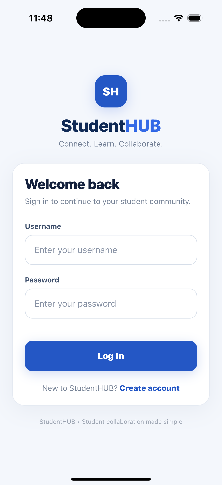
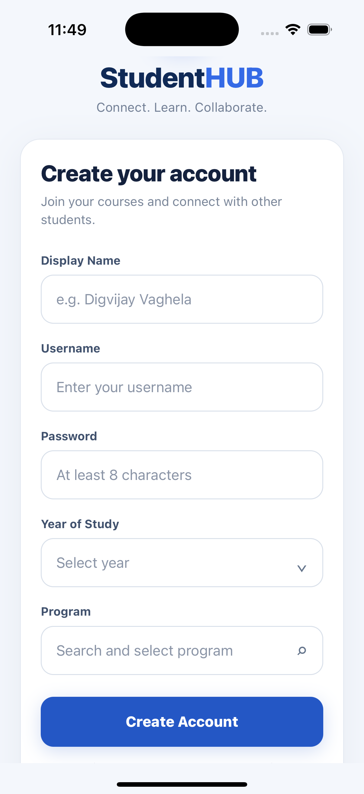
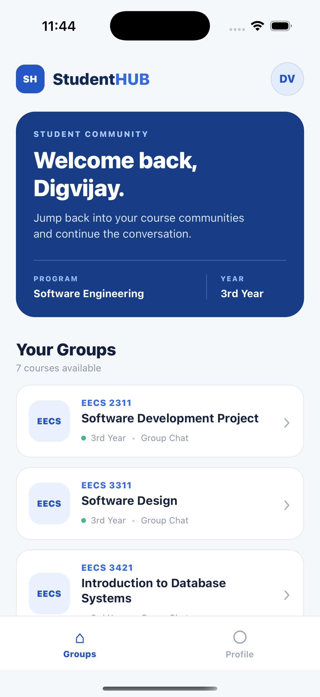
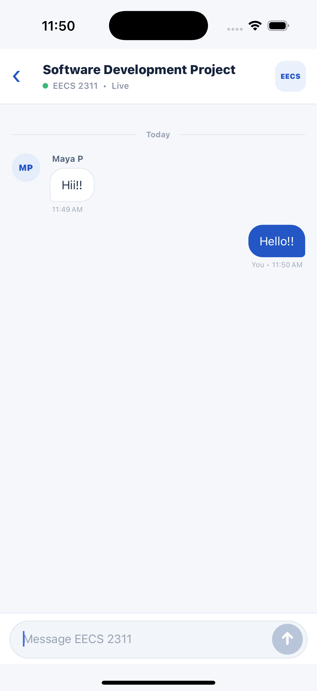
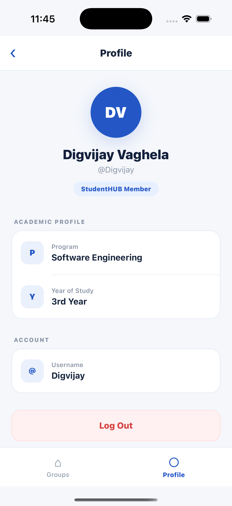

# StudentHUB — Real-Time Student Collaboration Platform

StudentHUB is a full-stack mobile application that allows students to join course-based communities and communicate through real-time group chats.

This repository is a cleaned and refactored portfolio version of the **Group Chat and related database functionality** I developed as part of a five-person Software Engineering course project at York University.

The portfolio version expands and modernizes my original contribution with authentication, PostgreSQL persistence, a REST API, Socket.IO real-time messaging, and a redesigned React Native interface.

## Features

### Authentication
- User registration and login
- Password hashing with bcrypt
- JWT-based authentication for REST API requests
- Persistent login sessions
- Server-side authenticated sender identity

### Student Profiles
- Display name and username
- Program selection with searchable dropdown
- Year-of-study selection
- Student profile screen
- Logout functionality

### Course Communities
- Course-based chat groups
- PostgreSQL-backed group data
- Dedicated chat room for each course
- Course information displayed throughout the interface

### Real-Time Chat
- Live messaging using Socket.IO
- Socket.IO rooms for course-specific conversations
- Persistent PostgreSQL message history
- Message timestamps
- Sender information
- Automatic real-time updates
- Duplicate-message prevention on the client

## Tech Stack

### Frontend
- React Native
- Expo
- TypeScript
- AsyncStorage
- Socket.IO Client

### Backend
- Node.js
- Express.js
- Socket.IO
- JSON Web Tokens
- bcrypt

### Database
- PostgreSQL
- Parameterized SQL queries
- Relational foreign-key constraints
- Database indexes

## Architecture

```text
┌─────────────────────────────┐
│    React Native / Expo      │
│                             │
│  Authentication             │
│  Course Groups              │
│  Real-Time Chat             │
│  Student Profile            │
└──────────────┬──────────────┘
               │
          REST + Socket.IO
               │
               ▼
┌─────────────────────────────┐
│      Node.js / Express      │
│                             │
│  Authentication API         │
│  Chat API                   │
│  JWT Verification           │
│  Socket.IO Server           │
└──────────────┬──────────────┘
               │
               │ SQL
               ▼
┌─────────────────────────────┐
│         PostgreSQL          │
│                             │
│  users                      │
│  chat_groups                │
│  messages                   │
└─────────────────────────────┘
```

## Application Flow

```text
Login / Register
       ↓
Course Groups
       ↓
Select Course
       ↓
Real-Time Group Chat

Course Groups
       ↓
Student Profile
```

## Database

The PostgreSQL schema contains three primary tables:

### `users`
Stores registered users and bcrypt password hashes.

### `chat_groups`
Stores course-based discussion groups.

### `messages`
Stores persistent chat messages and connects each message to a course group and registered user.

The repository includes a reproducible database schema and demo course groups in:

```text
backend/src/db/schema.sql
```

## REST API

### Authentication

| Method | Endpoint | Purpose |
|---|---|---|
| POST | `/api/auth/register` | Create a user account |
| POST | `/api/auth/login` | Authenticate a user |

### Chat

The chat endpoints require a valid JWT.

| Method | Endpoint | Purpose |
|---|---|---|
| GET | `/api/chat/groups` | Retrieve available course groups |
| GET | `/api/chat/messages?group_id=1` | Retrieve message history |
| POST | `/api/chat/messages` | Store and broadcast a message |

### System

| Method | Endpoint | Purpose |
|---|---|---|
| GET | `/api/health` | Check API status |

## Local Setup

### Prerequisites

Install:

- Node.js
- npm
- PostgreSQL
- Expo development environment

### 1. Clone the Repository

```bash
git clone <repository-url>
cd studenthub-group-chat
```

### 2. Create the PostgreSQL Database

```bash
createdb studenthub
```

Initialize the schema:

```bash
psql -d studenthub -f backend/src/db/schema.sql
```

This creates the required tables, indexes, relationships, and demo course groups.

### 3. Configure the Backend

```bash
cd backend
cp .env.example .env
npm install
```

Update `.env` with your local configuration:

```env
PORT=5001
DATABASE_URL=postgresql://YOUR_POSTGRES_USER@localhost:5432/studenthub
PGSSL=false
JWT_SECRET=replace_with_a_long_random_secret
```

Start the backend:

```bash
npm run dev
```

### 4. Configure the Frontend

Open another terminal:

```bash
cd frontend
cp .env.example .env
npm install
```

Set the backend address in the frontend environment file.

For the iOS simulator:

```env
EXPO_PUBLIC_BACKEND_URL=http://localhost:5001
```

For a physical device, use your computer's local network IP instead of `localhost`.

Start Expo:

```bash
npm start
```

## Security

This portfolio refactor improves the original course implementation by:

- Removing the original Supabase integration
- Removing credentials from source code
- Loading secrets through environment variables
- Excluding `.env` files from Git
- Hashing passwords with bcrypt
- Protecting REST chat endpoints with JWT authentication
- Deriving message sender identity from the authenticated user on the server
- Using parameterized PostgreSQL queries
- Validating message content server-side

For a production deployment, additional improvements would include authenticated Socket.IO connections, stricter CORS configuration, secure device token storage, rate limiting, and course-membership authorization.

## Project Background

StudentHUB was originally developed as a **five-person university Software Engineering team project at York University**.

My primary contribution to the original project was the **Group Chat feature and its related database functionality**, including:

- Chat-group functionality
- Message persistence and retrieval
- Real-time message updates
- Frontend/backend integration
- Database integration
- Debugging and integration work

This repository is a cleaned portfolio refactor centered on that contribution. It is not intended to represent the unrelated portions of the original team application as my individual work.

## Screenshots

### Authentication

<p align="center">
  
  &nbsp;&nbsp;&nbsp;
  
</p>

### Course Groups & Real-Time Chat

<p align="center">
  
  &nbsp;&nbsp;&nbsp;
  
</p>

### Student Profile

<p align="center">
  
</p>

## Future Improvements

- Authenticate Socket.IO connections using JWT
- Add course membership and authorization
- Add push notifications
- Add message editing and deletion
- Add account management
- Add automated backend and frontend tests
- Deploy the API and PostgreSQL database

## Author

**Digvijaysinh Vaghela**

Software Engineering Student — York University

GitHub: `Digvijay251`
